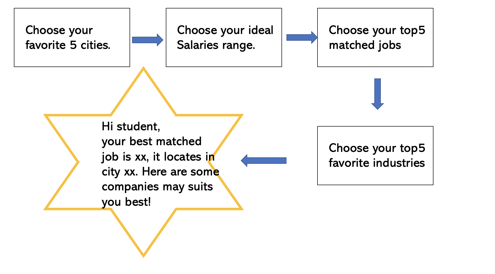

#1. Introduction
The H1B visa is an employment-based, non-immigrant visa for temporary workers. It is important for immigrants who want to work in the USA. Every year, the Employment and Training Administration in United States Department of Labor will disclose the data of H1B applications. The disclosure data including case_status, jobs, employers, salary and etc.                  

As international students, we want to use these data to explore more about H1B applications.
The first thing we want to know is the factors influence the application status. H1B is of great importance to international students. If we want to work in the USA for a longer time, we need to apply for H1B. Is there anything that can influence the certification of H1B? How can we increase the possibility of certification? These are our questions. We want to find the answer through the exploratory analysis of the H1B data. By figuring out the factors influence the H1B case status, we can improve the rate of certification when we apply H1B.

The second part we are paying attention to is the salary, industry, occupation and other information of the H1B applicants. Since H1B applicants are all international students, that is our elders and our seniors. Their experience can throw light on us. Their jobs, their industries, and their salaries can give us advice. Which job and which industry can get more salary? Which job and which industry are more friendly to international students? To achieve our dream, where should we go? These are the questions we want to address. We want to provide a guidance for the international students through data analysis.

In a word, this project will use the data of H1B applications from 10/1/2017 to 9/30/2018, focusing on the status of applications and other job-relevant information of applicants, trying to uncover the distribution and associations of the variables. 

Each team member involved in all parts and contributes equally to this project. Specifically, each member's major contribution is listed below.

* Ze Chen (zc2425) 
    * Data cleaning
    * Analysis of data quality
    * Main analysis: Salary part
    * Executive summary
    * Conclusion
* Alpha Lu (yl3963)
    * Description of data
    * Interactive component
    * Conclusion
* Chunran Yao (cy2511)
    * Introduction
    * Main analysis: H1B part
    * Executive summary
    
\newpage 
#2. Description of data
###Data Source:
https://www.foreignlaborcert.doleta.gov/performancedata.cfm (United States Department of Labor)

###Data dictionary
:https://github.com/slayAlphalu/EDAV/blob/master/data%20discription.pdf

###Data collection: 
The original dataset we used for our final project comes from the United States Department of Labor Employment and Training Administration official website. 
Link: https://www.foreignlaborcert.doleta.gov/performancedata.cfm

###Data access: 
Luckily, the official website mentioned above is open for users to download data without any authorization. Go to this link to see the data file we downloaded https://www.foreignlaborcert.doleta.gov/pdf/PerformanceData/2018/PERM_Disclosure_Data_FY2018_Q4_EOY.xlsx
 
The original dataset contains administrative data from employers’ Labor Condition Applications and the certification determinations processed by the Department’s Office of Foreign Labor Certification, Employment and Training Administration where the date of the determination was issued on or after October 1, 2017, and on or before September 30, 2018. All data were extracted from the Office of Foreign Labor Certification iCERT Visa Portal System; an electronic filing and application processing system of employer requests for H-1B nonimmigrant workers.
Public Disclosure File: H-1B iCERT LCA
Federal Fiscal Year: 2018
Reporting Period: October 1, 2017, through September 30, 2018
 
However, the original dataset is too tedious (52 unique variables and 54564360 observations in total) and prevents us from focusing on important details. To simplify the dataset, we omit some variables that are less important such as original certificate date. 

After data cleaning, our clean version of data consists of 25 unique variables and 6 of them are new variables.

\newpage
###Data Cleaning Process:
Data cleaning code link: https://github.com/slayAlphalu/EDAV/tree/master/data_clean

**Feature Engineering was first performed on the dataset. We create the following new variables:**

- annual wage(ANNUAL_WAGE): wages are standardized to annual wage, using information from Organization for Economic Co-operation and Development Website: average annual hours actually worked per worker for U.S. in 2017 is 1780 hours; there are 51 weeks between October 1 2017 and September 30 2018 period.  Thus, annual wage = 1780*hourly wage = 51*weekly wage = 25*bi-weekly wage = 12*monthly wage

(reference: https://stats.oecd.org/index.aspx?DataSetCode=ANHRS)

- wait time(WAIT_TIME): decision time = case decision time - case submitted time (in days)
occupation classification(OCCUPATION_CLASSIFICATION): we classify detailed occupations into 22 major groups using their respective SOC code. Standard Occupational Classification (SOC) system is a federal statistical standard used by federal agencies to classify workers into occupational categories for the purpose of collecting, calculating, or disseminating data.

 (reference:https://www.bls.gov/soc/2010/2010_major_groups.htm#45-0000)

- major industry(MAJOR_INDUSTRY): since each applicant’s occupation belongs to a specific industry, we classify cases into 20 major industries using their respective NAICS code. The North American Industry Classification System (NAICS) is the standard used by Federal statistical agencies in classifying business establishments for the purpose of collecting, analyzing, and publishing statistical data related to the U.S. business economy.

(reference: https://www.census.gov/programs-surveys/economic-census/guidance/understanding-naics.html)

- major NAICS code (MAJOR_NAICS_CODE): major NAICS sector code corresponds to MAJOR_INDUSTRY
major SOC code (MAJOR_SOC_CODE): major SOC code corresponds to variable corresponds to OCCUPATION_CLASSIFICATION

- entry mistake(ENTRY_MISTAKE): if an applicant has an extremely high annual wage that does not seems normal to his/her occupation, then we assume the applicant made an entry mistake. Entry mistake equals TRUE if there is an entry mistake, FALSE otherwise.

- annual wage lower  than prevailing wage(Lower_Than_PW): the H1B  visa program requires employers to “pay the prevailing wage or the actual wage paid by the employer to workers with similar skills and qualifications, whichever is higher.” Thus Lower_Than_PW equals TRUE if the applicant is  paid less than prevailing wage, FALSE otherwise.

(reference: https://www.foreignlaborcert.doleta.gov/wages.cfm)

**Outliers exclusion:**
Since outliers are informative and may reveal a pattern of  cause of denied H1B application, we don’t drop outliers when visualize case status or its relation with other variables.
Outliers are dropped when analyze wage or its relation with other variables. Observations that are greater than 1.5*interquartile range above upper-hinge are considered as outliers. 26867 outliers are dropped out of total 654360 observations. After dropping outliers, annual wage approximately follows normal distribution.

\newpage

**Data Dictionary after Data Cleaning**
                                 
FIELD NAME                            |             DESCRIPTION
-----------------------------------|     -----------------------
CASE_NUMBER     |Unique identifier assigned to each application     submitted for processing to the Chicago National                  Processing Center.
CASE_STATUS     |Status associated with the last significant event  or decision. Valid values include “Certified,”    “Certified-Withdrawn,” Denied,” and “Withdrawn”.
ANNUAL_WAGE | Standardized annual wage
WAGE_RATE_OF_PAY_FROM |Employer’s proposed wage rate.
WAGE_UNIT_OF_PAY  | Unit of pay. Valid values include “Hour", "Week", "Bi-Weekly", "Month", or "Year".
CASE_SUBMITTED  |Date and time the application was submitted.
DECISION_DATE   |Date on which the last significant event or        decision was recorded by the Chicago National        Processing Center.
EMPLOYER_NAME   |Name of employer submitting labor condition application.
EMPLOYER_BUSINESS_DBA |Trade Name or dba name of employer submitting labor condition application, if applicable.
EMPLOYER_CITY   |
EMPLOYER_STATE  |
EMPLOYER_COUNTRY|
EMPLOYER_POSTAL_CODE|Contact information of the Employer requesting temporary labor certification.
JOB_TITLE |Title of the job.
SOC_CODE|Occupational code associated with the job being requested for temporary labor condition, as                   classified by the Standard Occupational Classification (SOC) System.
SOC_NAME| Occupational name associated with the SOC_CODE.
NAICS_CODE | Industry code associated with the employer requesting permanent labor condition, as classified by the North American Industrial Classification System (NAICS).
MAJOR_NAICS_CODE | Major NAICS sector code corresponds to MAJOR_INDUSTRY 
MAJOR_INDUSTRY | A specific industry each applicant’s occupation belongs to 
MAJOR_SOC_CODE | Major SOC code corresponds to variable corresponds to OCCUPATION_CLASSIFICATION
OCCUPATION_CLASSIFICATION |Detailed occupations corresponding to the SOC code
PREVAILING_WAGE | Prevailing Wage for the job being requested for temporary labor condition.
PW_UNIT_OF_PAY | Unit of Pay. Valid values include “Daily (DAI),” “Hourly (HR),” “Bi-weekly (BI),” “Weekly (WK),” “Monthly (MTH),” and “Yearly (YR)”.
H-1B_DEPENDENT | Y = Employer is H-1B Dependent; N = Employer is not H-1B Dependent.
WAIT_TIME | Days you have to wait before you get the case result.
ENTRY_MISTAKE | Entry mistake equals TRUE if there is an entry mistake, FALSE otherwise
Lower_Than_PW | Annual wage lower  than prevailing wage, TRUE if the applicant is  paid less than prevailing wage, FALSE otherwise.


  
###Variables deserve our high attention are listed below:
1.   Case status: four status including certified, certified-withdrawn, denied, withdrawn which indicate the last decision
2.   Employer city and employer state: the information enable us to analyze data graphically
3.   Occupational classification:  the information enable  us to analyze individual occupations
4.   Major industry: the information enable  us to analyze overall industries
4.   Annual wage: another key factor we care about
5.   Wait time: it reveals how long we expect to get the H1B result

\newpage
#3. Analysis of Data Quality
```{r,echo=T,eval=TRUE,warning=FALSE,cache=T}
library(ggplot2)
library(skimr)
#load data
H1B <- read.csv('H1B_26variable.csv')
#data dimension
dim(H1B)
```

## Dataset Summary
```{r,echo=T,eval=TRUE,warning=FALSE,cache=T}
#data summary
summary(H1B)
```


## Analyze Missing Pattern
```{r,echo=T,eval=TRUE,warning=FALSE,cache=T, fig.height=5}
#check missing data pattern
library(extracat)
visna(H1B)
```

**Missing Data Pattern:**

By looking at missing data pattern, we tend to conclude that the quality of this dataset is good. Most variables either have no missing values or have smaller than 0.01% missing value. Variable "H1B_DEPENDENT" has most missing values, with only 2% missing value proportion. Thus, our visualization and analysis won't eroded by missing values.

## Analyze Variables

Given 26 variables:

**Categorical:** CASE_STATUS, WAGE_UNIT_OF_PAY, MAJOR_SOC_CODE, MAJOR_NAICS_CODE, MAJOR_INDUSTRY, EMPLOYER_CITY, EMPLOYER_STATE, EMPLOYER_POSTAL_CODE, EMPLOYER_COUNTRY, SOC_CODE, SOC_NAME, NAICS_CODE, PW_UNIT_OF_PAY, ENTRY_MISTAKE, H1B_DEPENDENT, OCCUPATIONAL_CLASSIFICATION

**Discrete:**WAIT_TIME
**Continuous:**  ANNUAL_WAGE, WAGE_RATE_OF_PAY_FROM, PREVAILING_WAGE

**Date:** CASE_SUBMITTED, DECISION_DATE

**Textual Data:** CASE_NUMBER, JOB_TITLE, EMPLOYER_NAME

**Analysis of Key Continuous Variables:**
```{r,echo=T,eval=TRUE,warning=FALSE,cache=T}
library(ggplot2)
library(ggpubr)
library(tidyverse)
#Variable "annual wage"
hist1 <- ggplot(data=H1B, aes(H1B$ANNUAL_WAGE)) + geom_histogram(fill="#404788FF") + 
  ggtitle("Annual Wage: with outliers") + xlab("Annual Wage($)") + 
  theme(plot.title = element_text(size=12))
#Drop outliers
upper <- summary(H1B$ANNUAL_WAGE)[5]+
  (summary(H1B$ANNUAL_WAGE)[5]-summary(H1B$ANNUAL_WAGE)[2])*1.5
H1B_clean <- H1B %>% filter(H1B$ANNUAL_WAGE<=upper & H1B$ANNUAL_WAGE>0)
hist2<- ggplot(data=H1B_clean, aes(ANNUAL_WAGE)) + geom_histogram(fill="#404788FF") + 
  ggtitle("Annual Wage: no outliers") + xlab("Annual Wage($)") + 
  theme(plot.title = element_text(size=12))
```

**Analysis of Key Discrete Variables:**
```{r,echo=T,eval=TRUE,warning=FALSE,cache=T}
#Variable "wait time"
H1B_waittime <- H1B %>% group_by(WAIT_TIME) %>% summarize(count=n())
hist3<-ggplot(data=H1B_waittime, aes(x=WAIT_TIME, y=count)) + 
  geom_bar(stat="identity", fill="#404788FF",width = 20) + ggtitle("Wait Time: with outliers") + 
  xlab("")+ theme(plot.title = element_text(size=12))
#Drop outliers
H1B_clean_waittime <- H1B %>% filter(H1B$WAIT_TIME<=20 & H1B$WAIT_TIME>0)
H1B_waittime2 <- H1B_clean_waittime %>% group_by(WAIT_TIME) %>% summarize(count=n())
hist4<-ggplot(data=H1B_waittime2, aes(x=WAIT_TIME, y=count)) + 
  geom_bar(stat="identity", fill="#404788FF") + ggtitle("Wait Time(days): no outliers") + 
  xlab("")+ theme(plot.title = element_text(size=12))
ggarrange(hist1,hist2, nrow=1, ncol = 2)
ggarrange(hist3,hist4, nrow=1, ncol = 2)
```

**Analysis of Key Categorical Variables:**
```{r,echo=T,eval=TRUE,warning=FALSE,cache=T, fig.height=20}
H1B_status <- H1B %>% group_by(CASE_STATUS) %>% summarize(count=n())
bar1 <- ggplot(data=H1B_status, aes(reorder(x=CASE_STATUS,count), y=count)) + 
  geom_bar(stat="identity", fill="#404788FF") + ggtitle("Case Status") + xlab("")+ 
  theme(plot.title = element_text(size=12))+coord_flip() 
H1B_dependent <- H1B %>% group_by(H1B_DEPENDENT) %>% summarize(count=n())
bar2 <-ggplot(data=H1B_dependent, aes(reorder(x=H1B_DEPENDENT, count), y=count)) + 
  geom_bar(stat="identity", fill="#404788FF") + ggtitle("Have H1B Dependent or Not") + xlab("")+ 
  theme(plot.title = element_text(size=12))+coord_flip()
H1B_unitpay <- H1B %>% group_by(WAGE_UNIT_OF_PAY) %>% summarize(count=n())
bar3 <- ggplot(data=H1B_unitpay, aes(reorder(x=WAGE_UNIT_OF_PAY, count), y=count)) + 
  geom_bar(stat="identity", fill="#404788FF") + ggtitle("Unit of Pay") + xlab("")+ 
  theme(plot.title = element_text(size=12))+coord_flip()
H1B_country <- H1B %>% group_by(EMPLOYER_COUNTRY) %>% summarize(count=n()) 
bar4 <- ggplot(data=H1B_country, aes(reorder(x=EMPLOYER_COUNTRY, count), y=count)) +
  geom_bar(stat="identity", fill="#404788FF") + ggtitle("Number of H1B Cases by Employer Country")  + 
  coord_flip() + xlab(" ")
H1B_industry <- H1B %>% group_by(MAJOR_INDUSTRY) %>% summarize(count=n())
bar5 <-ggplot(data=H1B_industry, aes(reorder(x=MAJOR_INDUSTRY, count), y=count)) + 
  geom_bar(stat="identity", fill="#404788FF") + ggtitle("Major Industry")  + 
  coord_flip() + xlab(" ")
H1B_occupation <- H1B %>% group_by(OCCUPATIONAL_CLASSIFICATION) %>% summarize(count=n())
bar6 <-ggplot(data=H1B_occupation, aes(reorder(x=OCCUPATIONAL_CLASSIFICATION, count), y=count)) +
  geom_bar(stat="identity", fill="#404788FF") + ggtitle("Occupational Classification")  + 
  coord_flip() + xlab(" ")
H1B_state <- H1B %>% group_by(EMPLOYER_STATE) %>% summarize(count=n()) 
bar7 <-ggplot(data=H1B_state, aes(reorder(x=EMPLOYER_STATE, count), y=count)) +
  geom_bar(stat="identity", fill="#404788FF") + ggtitle("Number of H1B Cases by Employer State")  + 
  coord_flip() + xlab(" ")
H1B2 <- read.csv("H1B_28variable.csv")
H1B_lower <- H1B2 %>% group_by(Lower_Than_PW) %>% summarize(count=n())
bar8 <- ggplot(data=H1B_lower, aes(reorder(x=Lower_Than_PW, count), y=count)) +
  geom_bar(stat="identity", fill="#404788FF") + ggtitle("Number of H1B Cases by Lower_Than_PW")  + 
  coord_flip() + xlab(" ")
```

```{r,echo=T,eval=TRUE,warning=FALSE,cache=T,fig.align="center",fig.height=10}
ggarrange(bar1, bar2, bar3, bar4, bar8, ncol = 1, nrow = 5)
```


```{r,echo=T,eval=TRUE,warning=FALSE,cache=T,fig.align="center", fig.height=8}
bar5
bar6
bar7
```


**Key Variables of Interest: **
- Variable "ANNUAL_WAGE" is influenced by large value outliers and it follows normal distribution after dropping outliers. 
- Variable "WAIT_TIME" is also influenced by large value outliers. After dropping variables, we observe that most of wait time are of H1B application are around 6 days. 
- Variable "CASE_STATUS": most cases are certified, which is siginificantly greater than other status.The second most case statu is certified-withdrawn.
- Variable "H1B_DEPENDENT": the number of applicants who don't have H1B dependents are approximately twice as those who have H1B dependents
- Variable "WAGE_UNIT_OF_PAY": most of wages are in the unit pay of year, with only a few in hour.
- Variable "EMPLOYER_COUNTRY": most of employer country is the United States.
- Variable "MAJOR_INDUSTRY": Professional, Scientific, and Technical Services Industry has most H1B cases, much more than other industries. Manufacturing is in the second position, and Finance and Insurance is in the thrid position.
- Variable "OCCUPATIONAL_CLASSIFICATION": Computer and Mathematical occupation has most H1B cases, far more than other occupational calssification.
- Variable "EMPLOYER_STATE": the top 3 U.S. states with most H1B cases are California, New Jersey, Texas.

\newpage
#4. Main Analysis
```{r setup, include=FALSE}
knitr::opts_chunk$set(echo = TRUE)
options(scipen = 10)
```
```{r message=FALSE, warning=FALSE}
library(GGally)
library(gridExtra)
library(ggpubr)
library(tidyverse)
library(dplyr)
library(viridis)
mycolor <- c("#404788FF")
```
```{r}
data <- read.csv("H1B_26variable.csv")
H1B <- data
```

## How Annual Wage Relates to H1B Case Status??
Salary is a significant attribute for any employee. So firstly, we want to know if salary will influence case status.
```{r}
ggplot(data, aes(x = data$CASE_STATUS, y = data$ANNUAL_WAGE))+
  geom_boxplot(fill = mycolor)+
  ggtitle("annual wage by different case status")+
  xlab("case status")+
  ylab("annual wage")+
  theme(plot.title = element_text(hjust = 0.5))
```
**Comments:**

However, there seem to be outliers in salary. According to this plot, there is an annual wage of 100000000 in the denied group, which is impossible.

By carefully cleaning the data, we can find more impossible data in the annual wage. To drop the outliers, limiting the salary within $300,000 since more than 99% annual wages are under 300,000.
```{r}
newdata <- data[which(data$ANNUAL_WAGE<300000),]
ggplot(newdata, aes(x = newdata$CASE_STATUS, y = newdata$ANNUAL_WAGE))+
  geom_violin(fill = mycolor, alpha = 0.5)+
  geom_boxplot(width = 0.1)+
  stat_summary(fun.y=mean, geom="point", shape=23, size = 2)+
  ggtitle("annual wage by different case status")+
  xlab("case status")+
  ylab("annual wage")+
  theme(plot.title = element_text(hjust = 0.5))
```
**Comments:**

Now the plot is much more clear. This is a violin plot displaying the distribution of annual wage by case status and the median as well as quartile. And this plot also show mean of each group with the diamondd. 
The median and the quartiles of different groups are generally the same, with only small differences. Specifically, the median is 87500 for certified, 80000 for certified-withdrawn, 79789 for denied, and 84000 for withdrawn. Despite that the mean of each group is higher than median, means across the groups show the same pattern with medians. Besides, there are more small value in denied than other groups; It seems that getting a reasonable annual wage is more helpful for H1B application.
In a word, getting more salary may slightly increase the chance of certification. But it is only slightly. 

### Mistakes in Annual Wage
For there outliers, we create a new variable called "entry_mistake" to flag whether the annual wage is correct(reasonable). If it is reasonable, the value of entry mistake is Flase; otherwise, the entry mistake is True.
```{r}
ggplot(data, aes(x = ENTRY_MISTAKE,fill = CASE_STATUS))+
  geom_bar(position = "fill")+
  ggtitle("do entry mistakes influence case status?")+
  xlab("entry mistake")+
  ylab("fraction")+
  theme(plot.title = element_text(hjust = 0.5))+
  scale_fill_viridis_d()
```
**Comments:**

Obviously, entry mistake has a great influence on case_status. Most of the applications without the mistakes in annual wage are certified; However, when there are mistakes in annual wage, most of the applications are either withdrawn or denied. It is rare to certify these applications compared to those without mistakes. Therefore, the entry mistakes in applications will highly decrease the chance of certification. If an applicant submits a wrong annual wage, we advise him/her withdraws it him/herself, otherwise, it is probably be denied.

### Annual Wage and Prevailing Wage
When we are looking at data, we found an interesting variable: "prevailing wage".It is the prevailing wage for the job being requested for temporary labor condition.
More interesting, we found the relationship between this variable and annual wage is highly associated with case status.
```{r message=FALSE, warning=FALSE}
prewage <- read_csv("H1B_28variable.csv")
prewage <- prewage[!is.na(prewage$Lower_Than_PW),]
ggplot(prewage, aes(x = prewage$Lower_Than_PW,fill = CASE_STATUS))+
  geom_bar(position = "fill")+
  ggtitle("Do wage and prevailing wage influence case status?")+
  xlab("Is annual wage lower than prevailing wage")+
  ylab("fraction")+
  theme(plot.title = element_text(hjust = 0.5))+
  scale_fill_viridis_d()
```
**Comments:**

As we can see, if an employee's annual wage is lower than prevailing wage, he/she will definitely not be certified with H1B visa. It looks like a salary more than prevailing wage is the prerequisite for H1B certification.

## How Wait Time Relates to H1B Case Status?
Wait time is the days ranging from date the application was submitted to date on which the last significant event or decision was recorded.

```{r,echo=T,eval=TRUE,warning=FALSE,cache=T}
#Drop outliers of annual wages
upper <- summary(H1B$ANNUAL_WAGE)[5]+
  (summary(H1B$ANNUAL_WAGE)[5]-summary(H1B$ANNUAL_WAGE)[2])*1.5
H1B_clean <- H1B %>% filter(H1B$ANNUAL_WAGE<=upper & H1B$ANNUAL_WAGE>0)
#plot scatterplot
ggplot(H1B_clean, aes(x=H1B_clean$WAIT_TIME, y=ANNUAL_WAGE, color =CASE_STATUS)) +
  geom_point(size=2,shape=23) + 
  ggtitle("How Wait Time Relates to H1B Case Status?")+
  xlab("Wait Time (day)")+ylab("Auunal Wage($)")+
  scale_color_viridis(discrete=TRUE)
```

**Comments:**

The above scatterplot is plotted to observe relation among annual wage and application wait time, by different H1B case status. Then, appliation wait time tend to have no relation with annual wages, since there are too many observations and the dots spread and cover from low annual wage to high annual wage. However, we found a pattern between wait time and case status: almost all the certified cases have wait time smaller than 7 days and cases may be certified-withdrawn within 1300 days.

To display them more clear:
```{r}
ggplot(data, aes(x = data$WAIT_TIME, y =data$CASE_STATUS )) +
  geom_point(color = mycolor, alpha = 0.1) + 
  facet_wrap(~ CASE_STATUS, ncol = 1, scales = "free") +     
  ylab("case status")+
  xlab("wait time (days)")+
  ggtitle("wait time by different case status")
```
**Comments:**

It is a scatter plot of wait time with different case status. From this plot, only the wait time of certified-withdrawn and withdrawn can exceed 10. It seems weird, but it is actually reasonable. Considering the meaning of wait time, it is the time between case submitted and decision date. The decision means the date on which the last significant event or decision was recorded; And withdrawn is a significant event. Now it is clear: the department will make the decision no more than 10 days, whether is CERTIFIED or DENIED; But the applications can be withdrawn even after 6 years submitting the case.  

## How H1B dependent Relates to H1B Case Status?
H1B-dependent is an important field in this dataset. It is used to describe the applicants' employers. Employers who hire ‘too many’ H1B workers are labeled H1B Dependent Employers.                                  
Whether or not an employer is H1B-dependent is mainly determined by the size of the company:                           
- 1-25 full-time employees of which at least 8 are H1B workers.
- 26 to 50 full-time employees of which at least 13 are H1B workers.
- 51 or more full-time employees of which 15% or more are H1B workers.
Intuitively, H1B dependent is associated with the case status: the applicants are more likely to be certified if their employers are H1B dependent.
```{r}
levels(data$H1B_DEPENDENT)[levels(data$H1B_DEPENDENT)=="Y"] <- "Yes"
levels(data$H1B_DEPENDENT)[levels(data$H1B_DEPENDENT)=="N"] <- "No"
dependentH1b <- group_by(data[!is.na(data$H1B_DEPENDENT),],H1B_DEPENDENT, CASE_STATUS) %>% summarise(number = n())
ggplot(data = dependentH1b, aes(x = H1B_DEPENDENT, y = number, fill = CASE_STATUS))+
  geom_bar(stat = "identity", position = "fill")+
  scale_fill_viridis_d()+
  ylab("fraction")+
  xlab("H1B dependent")+
  ggtitle("Does H1B dependent influence case status?")+
  theme(plot.title = element_text(hjust = 0.5))
```

**Comments:**

Although the association is not so strong, we cannot say they are irrelevant. The fraction of certified applications is more if the employers are H1B dependent. And if the employer is not H1B dependent, the application is more likely to be denied.
Therefore, to increase the chance of certification and decrease the chance of denial, maybe it is a good idea to work in an H1B-dependent company.

## How Occupations Relates to H1B Case Status?
It is reasonable to connect occupations with case status. Some occupations may be helpful for the H1B applications, others may be an obstruction, such as the military occupations.
SOC_CODE is the Occupational code associated with the job, so we can use SOC_CODE to represent the occupations.
```{r fig.width=8}
data$MAJOR_SOC_CODE <- as.factor(data$MAJOR_SOC_CODE)
SOCH1bPlot1 <- ggplot(data[!is.na(data$MAJOR_SOC_CODE), ], aes(x=MAJOR_SOC_CODE,fill=CASE_STATUS)) +
  geom_bar(position = "fill")+
  scale_fill_viridis_d()+
  ylab("fraction")+
  xlab("Major SOC CODE")+
  theme(legend.position = "top",plot.title = element_text(hjust = 0.5))
SOCH1bPlot2 <- ggplot(data[!is.na(data$MAJOR_SOC_CODE), ], aes(x=MAJOR_SOC_CODE,fill=CASE_STATUS)) +
  geom_bar()+
  scale_fill_viridis_d()+
  ylab("count")+
  xlab("Major SOC CODE")+
  theme(legend.position = "top",plot.title = element_text(hjust = 0.5))
SOCH1bPlot <- ggarrange(SOCH1bPlot2, SOCH1bPlot1, common.legend = TRUE)
annotate_figure(SOCH1bPlot,top = text_grob("Major SOC CODE in different case status"))
```
**Comments:**

According to the left plot, it seems that there is some association between the major SOC CODE and CASE_STATUS. For example, all the cases with MAJOR_SOC_CODE as 40 are certified. However, combining the right plot, which draws the number of each SOC_CODE with different status instead of the fraction, it is clear to see that there are little cases whose SOC_CODE are from 31 to 53. In fact, there is **only one** case whose MAJOR_SOC_CODE is 40. So the sample is too small and we can not draw a conclusion depending on these small samples.                                                          
From the right plot, we can see that many applicants having a SOC CODE from 11 to 29, especially 15. There are so many applications having Computer and Mathematical Occupations!                          
Thus, it is more reasonable to compare the cases with MAJOR_SOC_CODE from 11 to 29, where there are more cases. It is obvious that there are only small fluctuations. The certification of applications whose SOC CODE is 19 (Life, Physical, and Social Science Occupations) are more likely to be withdrawn by their employers. In general, the SOC_CODE (major) will not influence whether the H1B application will be certified or not. 
That is, the occupation of the applications will not influence case status.

## How Industries Relates to H1B Case Status??
The association between industry and case status is another reasonable hypothesis. Some hypothesis may have priority while others not. Since NAICS CODE is the Industry code, we use NAICS CODE to represent the industry.

```{r fig.width=11}
data$MAJOR_NAICS_CODE <- as.factor(data$MAJOR_NAICS_CODE)
NaicsH1bPlot1 <- ggplot(data, aes(x=MAJOR_NAICS_CODE,fill=CASE_STATUS)) +
  geom_bar(position = "fill")+
  scale_fill_viridis_d()+
  ylab("fraction")+
  xlab("Major NAICS CODE ")+
  theme(legend.position = "top",plot.title = element_text(hjust = 0.5))
NaicsH1bPlot2 <- ggplot(data, aes(x=MAJOR_NAICS_CODE,fill=CASE_STATUS)) +
  geom_bar()+
  scale_fill_viridis_d()+
  ylab("number")+
  xlab("Major NAICS CODE")+
  theme(legend.position = "top",plot.title = element_text(hjust = 0.5))
#grid.arrange(NaicsH1bPlot1, NaicsH1bPlot2, ncol = 2, nrow = 1)
NaicsH1bPlot <- ggarrange(NaicsH1bPlot2, NaicsH1bPlot1, common.legend = TRUE)
annotate_figure(NaicsH1bPlot,top = text_grob("Major NAICS CODE in different case status"))
```
**Comments:**

NAICS CODE shares the same pattern with SOC CODE: there is one code outweigh others. In SOC CODE, 15 (Computer and Mathematical Occupations) outweighs others; in NAICS CODE, 54 (Professional, Scientific, and Technical Services) outweighs other.
Combining the total number and the fraction of NAICS CODE with different case status, applications with NAICS code as 45 (Retail Trade) are more likely to be certified and the certification of applicants with 61 (Educational Services) tend to be withdrawn. In general, NAICS CODE doesn't influence case status greatly. That is, the industry will not influence the case status greatly.

More certified-withdrawn in Educational Services seems to be associated with the more certified-withdrawn in Life, Physical, and Social Science Occupations.                          
```{r}
univ1 <- data[which(data$MAJOR_NAICS_CODE == "61" & data$CASE_STATUS == "CERTIFIED-WITHDRAWN"),]
univ2 <- data[which(data$MAJOR_SOC_CODE == "19" & data$CASE_STATUS == "CERTIFIED-WITHDRAWN"),]
univ3 <- data[which((data$MAJOR_SOC_CODE == "19" |data$MAJOR_NAICS_CODE == "61") & data$CASE_STATUS == "CERTIFIED-WITHDRAWN"),]
```

Actually, there are 5833 certified-withdrawn cases in educational services, 3976 certified-withdrawn cases with life, physical, and social science Occupations. The overlay of these two are 2553 cases. There are totally 7256 apllicants either work in educational service or have a life, physical, and social science occupation.  

```{r}
pattern_univ <- "UNIV"
univ3 <- mutate(univ3, univ =str_detect(toupper(univ3$EMPLOYER_NAME),pattern_univ))
univ <- as.data.frame(table(univ3$univ))
levels(univ$Var1) <- c('No','Yes')
colnames(univ) <- c('university','count')
univ
```

**Comments:**

In the 7256 cases, more than two thirds are working in universities.That is, most of the 7256 applicants are postdocs, associates, researchers, and professors working in universities. Their H1B are more likely to be withdrawn. Since certified-withdrawn is a sign that employee leaves the company, the high certified-withdrawn indicates a high turnover in the universities.

```{r}
univ4 <- data[which(data$CASE_STATUS == "CERTIFIED-WITHDRAWN" & str_detect(toupper(data$EMPLOYER_NAME),pattern_univ) == TRUE),]
ggplot(univ4, aes(x = WAIT_TIME))+
  geom_histogram(aes(y=..density..),binwidth = 50, fill = mycolor, color = "white")+
  geom_density()+
  xlab("wait time")+
  ggtitle("wait time of the certified-withdrawn applicants working in universities")
```
**Comments:**

And this is the distribution of wait time of the certified-withdrawn applicants working in universities. Some of the employer will withdraw the apllicants' certification soon after they get it. But in general, it is uniformaly distributed, which means the time of the employees working in the universities are generally uniformly distributed. Some of them will work there for several months, others work for several years. Few of them work there for more than 4 years.

## Spatial Analysis- Where to go?
```{r,echo=T,eval=TRUE,warning=FALSE,cache=T}
#plot squares bin map
#devtools::install_github("hrbrmstr/statebins")
library(statebins)
library(viridis)
#annual wage by states
salary_bystate <- H1B_clean %>% filter(EMPLOYER_COUNTRY == "UNITED STATES OF AMERICA") %>%
  group_by(EMPLOYER_STATE) %>% summarize(Median=median(ANNUAL_WAGE)/1000) 
colnames(salary_bystate)[colnames(salary_bystate)=="EMPLOYER_STATE"] <- "state"
salary_bystate$state <- as.character(salary_bystate$state)
map1 <- statebins(salary_bystate, value_col="Median") + 
  ggtitle("Median Aunnual Wage($) of Different U.S. states")+
  theme(plot.title = element_text(size=18)) + 
  scale_fill_viridis(name="Wage(thousand)") +     theme(axis.line=element_blank(),axis.text.x=element_blank(),
          axis.text.y=element_blank(),axis.ticks=element_blank(),
          axis.title.x=element_blank(),
          axis.title.y=element_blank(),
          panel.background=element_blank(),panel.border=element_blank(),
          panel.grid.major=element_blank(),
          panel.grid.minor=element_blank(),plot.background=element_blank())
#job counts by states
jobcounts_bystate <- H1B %>% filter(EMPLOYER_COUNTRY == "UNITED STATES OF AMERICA") %>%
  group_by(EMPLOYER_STATE) %>% summarize(Job_Counts = n()/1000) 
colnames(jobcounts_bystate)[colnames(jobcounts_bystate)=="EMPLOYER_STATE"] <- "state"
jobcounts_bystate$state <- as.character(jobcounts_bystate$state)
map2 <- statebins(jobcounts_bystate, value_col="Job_Counts") + 
  ggtitle("Number of Job Opportunities in Different U.S. states")+
  theme(plot.title = element_text(size=18)) + 
  scale_fill_viridis(name="Job Counts (thousand)") +     theme(axis.line=element_blank(),axis.text.x=element_blank(),
          axis.text.y=element_blank(),axis.ticks=element_blank(),
          axis.title.x=element_blank(),
          axis.title.y=element_blank(),
          panel.background=element_blank(),panel.border=element_blank(),
          panel.grid.major=element_blank(),
          panel.grid.minor=element_blank(),plot.background=element_blank())
map1
map2
```

**Comments:**

Squarebin map is used here to better visualize wage or number of jobs of each U.S. state. Normal U.S. maps are used first, but we found that we cannot observe wage or number of jobs of some small states. Also, compared with bar plot, squarebin map can enable readers to observe geographical pattern. From the above maps, we can find the top 5 states with highest annual salary are: WA, PR, CA, ID, RI; top 5 states with highest job counts are: CA, NJ, TX, NY, IL. Although Washington has highest annual wage, but its number of job opportunities are far less than California. This stituation may occur because CA is famous for its high-tech industry and has more technical related jobs that are "H1B-friendly". Additionally, we also observe some states that are in the mid of the United States, such as MT, ND, SD, have limited annual wage and relatively low wage.

We have also tried to visualize how wage related to different cities. However, the city name is messy, for example, many city names are actually community names.


## Choose which occupation: Annual Wage ~ Occupational Classification
```{r,echo=T,eval=TRUE,warning=FALSE,cache=T}
salary_byoccupation <- H1B_clean %>% group_by(OCCUPATIONAL_CLASSIFICATION) %>% 
  summarize(Mean=mean(ANNUAL_WAGE), Median=median(ANNUAL_WAGE)) %>% filter(is.na(OCCUPATIONAL_CLASSIFICATION)==FALSE)
ggplot(data=salary_byoccupation, aes(x=reorder(OCCUPATIONAL_CLASSIFICATION, Mean), 
                                     y=Mean)) + 
  geom_bar(stat="identity",fill="#404788FF") + ylab("Mean Annual Wage($)") +
  xlab("Occupational Classification") + 
  ggtitle("Mean Annual Wage by Occupations") +
  coord_flip() + theme(plot.title = element_text(size=14))
```
**Comments:**

From the bar plot, we can see how annual wage varies across different occupational classification. We choose to visualize mean annual wage. Since the annual wage is normally distributed after dropping outliers, the bar plot of median annual wage is similar to mean annual wage. The top five occupational classifications with annual highest salary: Management, Sales and Related Occupation, Computer and Mathematical, Architecture and Engineering, Business and Financial Operations. The three occupational classifications with lowest annual salary: Healthcare Support, Personal Care and Service, Building and Grounds Cleaning and Maintenance. We observe that management position and occupation that requires expertised skills (e.g. computer, engineering) tend to have higher wages than other jobs. 

Additionally, we need to analyse this graph together with frequency of different occupations, because number of different occupations may vary greatly. For example, management occupation, as the highest wage occupation, may only has small number of jobs. Also, wage estimation of occupation classifications who have only a few cases(e.g. protective service occupation, construction and extraction occupation) may be inaccurate due to small sample size.

## Choose which industry: Annual Wage ~ Major Industry
```{r,echo=T,eval=TRUE,warning=FALSE,cache=T}
salary_byindustry <- H1B_clean %>% group_by(MAJOR_INDUSTRY) %>% 
  summarize(Mean=mean(ANNUAL_WAGE), Median=median(ANNUAL_WAGE)) %>% 
  filter(is.na(MAJOR_INDUSTRY)==FALSE &MAJOR_INDUSTRY!=0)
ggplot(data=salary_byindustry, aes(x=reorder(MAJOR_INDUSTRY, Mean), 
                                     y=Mean)) + 
  geom_bar(stat="identity",fill="#404788FF") + ylab("Mean Annual Wage($)") +
  xlab("Major Industry") + 
  ggtitle("Mean Annual Wage by Major Industry") +
  coord_flip()
```

**Comments:**

From the bar plot, we can see how annual wage varies across different industries. We choose to visualize mean annual wage. Since the annual wage is normally distributed after dropping outliers, the bar plot of median annual wage is similar to mean annual wage. The top 3 industries with the highest annual wage are information industry, management of Companies and Enterprises Industry and Retail Trade Industry. In contrast, Agriculture, Forestry, Fishing and Hunting, Educational Servcies and Arts, Entertainment and Recreation industry tend to have lower averge wage. 

Additionally, we need to analyse this graph together with frequency of different industries, because industry size may vary greatly. For example, the lowest wage industry, Agriculture, Forestry, Fishing and Hunting, only have a few cases, so the calculated annual wage may not be accurate. 

This limitation is caused by the nature of the dataset, because the dataset is a H1B application dataset, so some industires(e.g.: public administration industry and utilities industry) may be exclusive to foreign citizens. Thus, these conclusions and advice to some extent lose generality and more suitable to future  H1B applicants.


## Choose which company: Annual wage ~ Employer
```{r,echo=T,eval=TRUE,warning=FALSE,cache=T}
#wage by employer
salary_byemployer <- H1B_clean %>% group_by(EMPLOYER_NAME) %>% 
  summarize(Mean=mean(ANNUAL_WAGE), Median=median(ANNUAL_WAGE)) %>% 
  filter(is.na(EMPLOYER_NAME)==FALSE) %>% arrange(desc(Mean)) %>%
  top_n(15)
salary_byemployer_subset <- salary_byemployer %>% filter(Median > 165000)
ggplot(data=salary_byemployer_subset, aes(x=reorder(EMPLOYER_NAME, Median), 
                                     y=Median)) + 
  geom_bar(stat="identity",fill="#404788FF")+ theme(plot.title = element_text(size=12),
axis.text.x=element_text(angle = 30,vjust = 0.6,size = 8)) + ylab("Median Annual Wage($)") +
  xlab("Employer Name") + 
  ggtitle("Median Annual Wage by Employer") +
  coord_flip()
#employer counts
salary_byemployer <- H1B_clean %>% group_by(EMPLOYER_NAME) %>% 
  summarize(count=n()) %>% 
  filter(is.na(EMPLOYER_NAME)==FALSE)  %>%
  arrange(desc(count))  %>%
  top_n(20)
ggplot(data=salary_byemployer, aes(x=reorder(EMPLOYER_NAME, count), y=count)) + 
  geom_bar(stat="identity",fill="#404788FF")+ theme(plot.title = element_text(size=12),
axis.text.x=element_text(angle = 30,vjust = 0.6,size = 8)) + ylab("Number of H1B Jobs Provided") +
  xlab("Employer Name") + 
  ggtitle("Top 20 Companies Provide Most H1B Jobs") +
  coord_flip()
```
**Comments:**

When explore employers, we find that the bar graph of annual wage over different employers (e.g.: 13 highest wage companies) is not informative. The reason is that the average wage includes wages of different level of positions of that company, so there is no great difference between many companies in terms of average annual wages. After looking through the 20 companies with highest wages, we find that many of them are medical institutions.

The bar graph of number of jobs over different employers (e.g.: 20 companies with most H1B cases) is informative, because it can give readers a sense about which company is more "H1B-friendly". We can see that Deloitte Consulting, TATA Consultancy Services, Infosys, Cognizant Technology Solutions support much more H1B applications than other employers, so they can be regarded as "H1B-friendly" companies. However, size of companies may be an important confounding variable that affects this conclusion.


## Explore Different Occupation's Major Industry
```{r,echo=T,eval=TRUE,warning=FALSE,cache=T, fig.height=18, fig.width=15}
occupation_industry <- H1B_clean %>% group_by(MAJOR_SOC_CODE,MAJOR_NAICS_CODE) %>% 
  summarise(Freq=n())
occupation_industry2 <- H1B_clean %>% 
  group_by(OCCUPATIONAL_CLASSIFICATION,MAJOR_INDUSTRY) %>% 
  summarise(count=n())
#Architecture and Engineering
architecture <- occupation_industry2 %>% 
  filter(OCCUPATIONAL_CLASSIFICATION=="Architecture and Engineering") %>%
  arrange(desc(count)) %>%
  top_n(5)
o1 <- ggplot(data=architecture, aes(x=reorder(MAJOR_INDUSTRY, -count), 
                                     y=count)) + 
  geom_bar(stat="identity",fill="#404788FF") + 
  ylab("Number of Job Opportunities") +
  xlab("Major Industry") + 
  ggtitle("Architecture and Engineering Occupation's Top 5 Industry") + 
  theme(plot.title = element_text(size=12),
axis.text.x=element_text(angle = 10,vjust = 0.6,size = 10))
#Arts, Design, Entertainment, Sports, and Media
Arts <- occupation_industry2 %>% 
  filter(OCCUPATIONAL_CLASSIFICATION=="Arts, Design, Entertainment, Sports, and Media") %>%
  arrange(desc(count)) %>%
  top_n(5)
o2 <- ggplot(data=Arts, aes(x=reorder(MAJOR_INDUSTRY, -count), 
                                     y=count)) + 
  geom_bar(stat="identity",fill="#404788FF") + 
  ylab("Number of Job Opportunities") +
  xlab("Major Industry") + 
  ggtitle("Arts, Design, Entertainment, Sports, and Media Occupation's Top 5 Industry") + 
  theme(plot.title = element_text(size=12),
axis.text.x=element_text(angle = 10,vjust = 0.6,size = 10))
#Neglect occupation classification "Building and Grounds Cleaning and Maintenance"
#only 7 observations
#Business and Financial Operations
Business <- occupation_industry2 %>% 
  filter(OCCUPATIONAL_CLASSIFICATION=="Business and Financial Operations") %>%
  arrange(desc(count)) %>%
  top_n(5)
o3 <-ggplot(data=Business, aes(x=reorder(MAJOR_INDUSTRY, -count), 
                                     y=count)) + 
  geom_bar(stat="identity",fill="#404788FF") + 
  ylab("Number of Job Opportunities") +
  xlab("Major Industry") + 
  ggtitle("Business and Financial Operations Occupation's Top 5 Industry") + 
  theme(plot.title = element_text(size=12),
axis.text.x=element_text(angle = 10,vjust = 0.6,size = 10))
#Community and Social Service
Community <- occupation_industry2 %>% 
  filter(OCCUPATIONAL_CLASSIFICATION=="Community and Social Service") %>%
  arrange(desc(count)) %>%
  top_n(5)
o4 <-ggplot(data=Community, aes(x=reorder(MAJOR_INDUSTRY, -count), y=count)) + 
  geom_bar(stat="identity",fill="#404788FF") + 
  ylab("Number of Job Opportunities") +
  xlab("Major Industry") + 
  ggtitle("Community and Social Service Occupation's Top 5 Industry") + 
  theme(plot.title = element_text(size=12),
axis.text.x=element_text(angle = 10,vjust = 0.6,size = 10))
#Computer and Mathematical
Computer <- occupation_industry2 %>% 
  filter(OCCUPATIONAL_CLASSIFICATION=="Computer and Mathematical") %>%
  arrange(desc(count)) %>%
  top_n(5)
o5 <-ggplot(data=Computer, aes(x=reorder(MAJOR_INDUSTRY, -count), y=count)) + 
  geom_bar(stat="identity",fill="#404788FF") + 
  ylab("Number of Job Opportunities") +
  xlab("Major Industry") + 
  ggtitle("Computer and Mathematical Occupation's Top 5 Industry") + 
  theme(plot.title = element_text(size=12),
axis.text.x=element_text(angle = 10,vjust = 0.6,size = 10))
#Construction and Extraction
Construction <- occupation_industry2 %>% 
  filter(OCCUPATIONAL_CLASSIFICATION=="Construction and Extraction") %>%
  arrange(desc(count)) %>%
  top_n(5)
o6 <-ggplot(data=Construction, aes(x=reorder(MAJOR_INDUSTRY, -count), y=count)) + 
  geom_bar(stat="identity",fill="#404788FF") + 
  ylab("Number of Job Opportunities") +
  xlab("Major Industry") + 
  ggtitle("Construction and Extraction Occupation's Top 5 Industry") + 
  theme(plot.title = element_text(size=12),
axis.text.x=element_text(angle = 10,vjust = 0.6,size = 10))
#Educational, Traning, and Library
Educational <- occupation_industry2 %>% 
  filter(OCCUPATIONAL_CLASSIFICATION=="Educational, Traning, and Library") %>%
  arrange(desc(count)) %>%
  top_n(5)
o7 <-ggplot(data=Educational, aes(x=reorder(MAJOR_INDUSTRY, -count), y=count)) + 
  geom_bar(stat="identity",fill="#404788FF") + 
  ylab("Number of Job Opportunities") +
  xlab("Major Industry") + 
  ggtitle("Educational, Traning, and Library Occupation's Top 5 Industry") + 
  theme(plot.title = element_text(size=12),
axis.text.x=element_text(angle = 10,vjust = 0.6,size = 10))
#Farming, Fishing, and Forestry
Farming <- occupation_industry2 %>% 
  filter(OCCUPATIONAL_CLASSIFICATION=="Farming, Fishing, and Forestry") %>%
  arrange(desc(count)) %>%
  top_n(5)
o8 <-ggplot(data=Farming, aes(x=reorder(MAJOR_INDUSTRY, -count), y=count)) + 
  geom_bar(stat="identity",fill="#404788FF") + 
  ylab("Number of Job Opportunities") +
  xlab("Major Industry") + 
  ggtitle("Farming, Fishing, and Forestry Occupation's Top 5 Industry") + 
  theme(plot.title = element_text(size=12),
axis.text.x=element_text(angle = 10,vjust = 0.6,size = 10))
#Negelect Food Preparation and Serving Related: too few observations
#Healthcare Practitioners and Technical
Healthcare <- occupation_industry2 %>% 
  filter(OCCUPATIONAL_CLASSIFICATION=="Healthcare Practitioners and Technical") %>%
  arrange(desc(count)) %>%
  top_n(5)
o9 <-ggplot(data=Healthcare, aes(x=reorder(MAJOR_INDUSTRY, -count), y=count)) + 
  geom_bar(stat="identity",fill="#404788FF") + 
  ylab("Number of Job Opportunities") +
  xlab("Major Industry") + 
  ggtitle("Healthcare Practitioners and Technical Occupation's Top 5 Industry") + 
  theme(plot.title = element_text(size=12),
axis.text.x=element_text(angle = 10,vjust = 0.6,size = 10))
#Healthcare Support
Support <- occupation_industry2 %>% 
  filter(OCCUPATIONAL_CLASSIFICATION=="Healthcare Support") %>%
  arrange(desc(count)) %>%
  top_n(5)
o10 <-ggplot(data=Support, aes(x=reorder(MAJOR_INDUSTRY, -count), y=count)) + 
  geom_bar(stat="identity",fill="#404788FF") + 
  ylab("Number of Job Opportunities") +
  xlab("Major Industry") + 
  ggtitle("Healthcare Support's Top 5 Industry") + 
  theme(plot.title = element_text(size=12),
axis.text.x=element_text(angle = 10,vjust = 0.6,size = 10))
#Installation, Maintenance, and Repair
Installation <- occupation_industry2 %>% 
  filter(OCCUPATIONAL_CLASSIFICATION=="Installation, Maintenance, and Repair") %>%
  arrange(desc(count)) %>%
  top_n(5)
o11 <-ggplot(data=Installation, aes(x=reorder(MAJOR_INDUSTRY, -count), y=count)) + 
  geom_bar(stat="identity",fill="#404788FF") + 
  ylab("Number of Job Opportunities") +
  xlab("Major Industry") + 
  ggtitle("Installation, Maintenance, and Repair Occupation's Top 5 Industry") + 
  theme(plot.title = element_text(size=12),
axis.text.x=element_text(angle = 10,vjust = 0.6,size = 10))
#Legal Occupations
Legal <- occupation_industry2 %>% 
  filter(OCCUPATIONAL_CLASSIFICATION=="Legal Occupations") %>%
  arrange(desc(count)) %>%
  top_n(5)
o12 <-ggplot(data=Legal, aes(x=reorder(MAJOR_INDUSTRY, -count), y=count)) + 
  geom_bar(stat="identity",fill="#404788FF") + 
  ylab("Number of Job Opportunities") +
  xlab("Major Industry") + 
  ggtitle("Legal Occupations's Top 5 Industry") + 
  theme(plot.title = element_text(size=12),
axis.text.x=element_text(angle = 10,vjust = 0.6,size = 10))
#Life, Physical, and Social Science
Life <- occupation_industry2 %>% 
  filter(OCCUPATIONAL_CLASSIFICATION=="Life, Physical, and Social Science") %>%
  arrange(desc(count)) %>%
  top_n(5)
o13 <-ggplot(data=Life, aes(x=reorder(MAJOR_INDUSTRY, -count), y=count)) + 
  geom_bar(stat="identity",fill="#404788FF") + 
  ylab("Number of Job Opportunities") +
  xlab("Major Industry") + 
  ggtitle("Life, Physical, and Social Science Occupation's Top 5 Industry") + 
  theme(plot.title = element_text(size=12),
axis.text.x=element_text(angle = 10,vjust = 0.6,size = 10))
#Management
Management <- occupation_industry2 %>% 
  filter(OCCUPATIONAL_CLASSIFICATION=="Management") %>%
  arrange(desc(count)) %>%
  top_n(5)
o14 <-ggplot(data=Management, aes(x=reorder(MAJOR_INDUSTRY, -count), y=count)) + 
  geom_bar(stat="identity",fill="#404788FF") + 
  ylab("Number of Job Opportunities") +
  xlab("Major Industry") + 
  ggtitle("Management Occupation's Top 5 Industry") + 
  theme(plot.title = element_text(size=12),
axis.text.x=element_text(angle = 10,vjust = 0.6,size = 10))
#Office and Administrative Support
Office <- occupation_industry2 %>% 
  filter(OCCUPATIONAL_CLASSIFICATION=="Office and Administrative Support") %>%
  arrange(desc(count)) %>%
  top_n(5)
o15 <-ggplot(data=Office, aes(x=reorder(MAJOR_INDUSTRY, -count), y=count)) + 
  geom_bar(stat="identity",fill="#404788FF") + 
  ylab("Number of Job Opportunities") +
  xlab("Major Industry") + 
  ggtitle("Office and Administrative Support Occupation's Top 5 Industry") + 
  theme(plot.title = element_text(size=12),
axis.text.x=element_text(angle = 10,vjust = 0.6,size = 10))
#Personal Care and Service
Personal <- occupation_industry2 %>% 
  filter(OCCUPATIONAL_CLASSIFICATION=="Personal Care and Service") %>%
  arrange(desc(count)) %>%
  top_n(5)
o16 <-ggplot(data=Personal, aes(x=reorder(MAJOR_INDUSTRY, -count), y=count)) + 
  geom_bar(stat="identity",fill="#404788FF") + 
  ylab("Number of Job Opportunities") +
  xlab("Major Industry") + 
  ggtitle("Personal Care and Service Occupation's Top 5 Industry") + 
  theme(plot.title = element_text(size=12),
axis.text.x=element_text(angle = 10,vjust = 0.6,size = 10))
#Production
Production <- occupation_industry2 %>% 
  filter(OCCUPATIONAL_CLASSIFICATION=="Production") %>%
  arrange(desc(count)) %>%
  top_n(5)
o17 <-ggplot(data=Production, aes(x=reorder(MAJOR_INDUSTRY, -count), y=count)) + 
  geom_bar(stat="identity",fill="#404788FF") + 
  ylab("Number of Job Opportunities") +
  xlab("Major Industry") + 
  ggtitle("Production Occupation's Top 5 Industry") + 
  theme(plot.title = element_text(size=12),
axis.text.x=element_text(angle = 10,vjust = 0.6,size = 10))
#Neglect Protective Service Occupation, because too few observations(n=26)
#Sales and Related
Sales <- occupation_industry2 %>% 
  filter(OCCUPATIONAL_CLASSIFICATION=="Sales and Related") %>%
  arrange(desc(count)) %>%
  top_n(5)
o18 <-ggplot(data=Sales, aes(x=reorder(MAJOR_INDUSTRY, -count), y=count)) + 
  geom_bar(stat="identity",fill="#404788FF") + 
  ylab("Number of Job Opportunities") +
  xlab("Major Industry") + 
  ggtitle("Sales and Related Occupation's Top 5 Industry") + 
  theme(plot.title = element_text(size=12),
axis.text.x=element_text(angle = 10,vjust = 0.6,size = 10))
#Transportation and Material Moving
Transportation <- occupation_industry2 %>% 
  filter(OCCUPATIONAL_CLASSIFICATION=="Transportation and Material Moving") %>%
  arrange(desc(count)) %>%
  top_n(5)
o19 <-ggplot(data=Transportation, aes(x=reorder(MAJOR_INDUSTRY, -count), y=count)) + 
  geom_bar(stat="identity",fill="#404788FF") + 
  ylab("Number of Job Opportunities") +
  xlab("Major Industry") + 
  ggtitle("Transportation and Material Moving Occupation's Top 5 Industry") + 
  theme(plot.title = element_text(size=12),
axis.text.x=element_text(angle = 10,vjust = 0.6,size = 10))
ggarrange(o1,o2,o3,o4,o5,o6,o7,o8,o9, nrow=3, ncol = 3)
ggarrange(o10,o11,o12,o13,o14,o15,o16,o17,o18,o17, nrow=4, ncol = 3)
```

**Comments:**
 
The above bar plots show how different occupation's 5 major industries. These graphs enable readers to learn a specific occupation's major industry pattern. For example, Architecture and Engineering Occupation is mainly in professional, scientific and techinical services industry and manufacturing industry. Thus, a graduate whose studies architecture or engineering can look for jobs in these two industries.


\newpage
#5. Executive Summary
```{r echo=FALSE, message=FALSE, warning=FALSE}
library(GGally)
library(gridExtra)
library(ggpubr)
library(tidyverse)
library(dplyr)
library(viridis)
mycolor <- c("#404788FF")
```

```{r echo=FALSE}
data <- read.csv("H1B_26variable.csv")
H1B <- data
```

## 5.1 How can our H1B get certified?
### 1. First and foremost, don’t make mistakes
```{r echo=FALSE,fig.height=3}
data$ENTRY_MISTAKE <- as.factor(data$ENTRY_MISTAKE)
levels(data$ENTRY_MISTAKE) <- c("No","Yes")
ggplot(data, aes(x = ENTRY_MISTAKE,fill = CASE_STATUS))+
  geom_bar(position = "fill")+
  ggtitle("Do mistakes influence case status?")+
  xlab("Is there a wrong wage in application?")+
  ylab("fraction")+
  theme(plot.title = element_text(hjust = 0.5, size = 14))+
  scale_fill_viridis_d()
```

People usually make mistakes. However, making a mistake when filling out H1B application will be terrible. We take the mistakes in wage as an example. If there is a mistake, that is, the wage is unreasonable (too large or too small), then the rate of certification will decrease a lot, from more than 75% to fewer than 20%. So be careful, do not make mistakes in application. Be sure that all of the information is correct. 

### 2. Secondly, getting a higher wage than the prevailing wage
```{r echo=FALSE, message=FALSE, warning=FALSE,fig.height=3}
prewage <- read_csv("H1B_28variable.csv")
prewage$Lower_Than_PW <- as.factor(prewage$Lower_Than_PW)
levels(prewage$Lower_Than_PW) <- c("No","Yes")
prewage <- prewage[!is.na(prewage$Lower_Than_PW),]
ggplot(prewage, aes(x = prewage$Lower_Than_PW,fill = CASE_STATUS))+
  geom_bar(position = "fill")+
  ggtitle("What if wage is lower than prevailing wage?")+
  xlab("Is annual wage lower than prevailing wage?")+
  ylab("fraction")+
  theme(plot.title = element_text(hjust = 0.5, size = 14))+
  scale_fill_viridis_d()
```

Prevailing wage is the wage for the job being requested for temporary labor condition. It is a compulsory minimum wage. If an employee’s wage is lower than the prevailing wage, as we can see from the plot above, nobody was certified. Getting a higher wage than prevailing wage is prerequisite for getting an H1B certification. If you are not, unfortunately, you will definitely lose the chance of certification. But do not worry, you can file a complaint with DOL on form WH4, and DOL will make the employer pay the salary.

### 3. And … Good luck!
Admittedly, there is no other factor contributes to the certification of H1B, which makes us frustrating. But it also indicates that H1B Visa Lottery is random and fair. The only thing we can do is - Wait and hope!

### 4. Additionally: Tips After Submitting Application
#### 4.1 How long can I get my decision?

```{r echo=FALSE, message=FALSE, warning=FALSE,fig.height=3}
#Drop outliers of annual wages
upper <- summary(H1B$ANNUAL_WAGE)[5]+
  (summary(H1B$ANNUAL_WAGE)[5]-summary(H1B$ANNUAL_WAGE)[2])*1.5
H1B_clean <- H1B %>% filter(H1B$ANNUAL_WAGE<=upper & H1B$ANNUAL_WAGE>0)

#plot scatterplot
ggplot(H1B_clean, aes(x=H1B_clean$WAIT_TIME, y=ANNUAL_WAGE, color =CASE_STATUS)) +
  geom_point(size=2,shape=23) + 
  ggtitle("How Wait Time Relates to H1B Case Status?")+
  xlab("Wait Time (day)")+ylab("Auunal Wage($)")+
  scale_color_viridis(discrete=TRUE)
```

```{r echo=FALSE,fig.height=3}
H1B_clean_waittime <- H1B %>% filter(H1B$WAIT_TIME<=20 & H1B$WAIT_TIME>0)
H1B_waittime2 <- H1B_clean_waittime %>% group_by(WAIT_TIME) %>% summarize(count=n()/1000)
ggplot(data=H1B_waittime2, aes(x=WAIT_TIME, y=count)) + 
  geom_bar(stat="identity", fill="#404788FF") + ggtitle("Wait Time(days): no outliers") + 
  xlab("Wait Time (Days)")+ ylab("count (in thousand)")+theme(plot.title = element_text(size=12))
```

If you submit your H1B application but still get the decision after 7 days, oops, you need to pay attention. From the graph, we can learn that most applications are certified within 7 days.

#### 4.2 A High Employee Turnover in some industries and occupations
```{r echo=FALSE,fig.height=4}
certiwithind <- mutate(data, certiwith = data$CASE_STATUS=="CERTIFIED-WITHDRAWN")
certiwithind$certiwith <- as.factor(certiwithind$certiwith)
certiwithind <- certiwithind[which(!is.na(certiwithind$MAJOR_INDUSTRY)),]
certiwithind <- certiwithind %>% group_by(MAJOR_INDUSTRY,certiwith) %>% summarise(number = n())
certiwithindall <- certiwithind %>% group_by(MAJOR_INDUSTRY) %>% summarise(number = sum(number))
certiwithind <- merge(certiwithind[which(certiwithind$certiwith == TRUE),],certiwithindall, by = "MAJOR_INDUSTRY")
certiwithind <- mutate(certiwithind, fraction = number.x/number.y)
graph1 <- ggplot(certiwithind,aes(x = reorder(MAJOR_INDUSTRY, fraction), y= fraction))+
  geom_bar(stat = "identity",fill = mycolor)+
  coord_flip()+
  ylab("percentage")+
  xlab("industry")+
  ggtitle("percentage of certified-withdrawn 
   in different industries")+
  theme(plot.title = element_text(hjust = 0.5, size = 14))+
  theme(axis.text.y = element_text(size=9))
```

```{r echo=FALSE,fig.height=6}
certiwithoccu <- mutate(data, certiwith = data$CASE_STATUS=="CERTIFIED-WITHDRAWN")
certiwithoccu$certiwith <- as.factor(certiwithoccu$certiwith)
certiwithoccu <- certiwithoccu[which(!is.na(certiwithoccu$OCCUPATIONAL_CLASSIFICATION)),]
certiwithoccu <- certiwithoccu %>% group_by(OCCUPATIONAL_CLASSIFICATION,certiwith) %>% summarise(number = n())
certiwithoccuall <- certiwithoccu %>% group_by(OCCUPATIONAL_CLASSIFICATION) %>% summarise(number = sum(number))
certiwithoccu <- merge(certiwithoccu[which(certiwithoccu$certiwith == TRUE),],certiwithoccuall, by = "OCCUPATIONAL_CLASSIFICATION")
certiwithoccu <- mutate(certiwithoccu, fraction = number.x/number.y)
graph2<- ggplot(certiwithoccu,aes(x = reorder(OCCUPATIONAL_CLASSIFICATION, fraction), y= fraction))+
  geom_bar(stat = "identity",fill = mycolor)+
  coord_flip()+
  ylab("percentage")+
  xlab("occupation")+
  ggtitle("percentage of certified-withdrawn 
  in different occupations")+
  theme(plot.title = element_text(hjust = 0.5, size = 14))+
  theme(axis.text.y = element_text(size=9))

ggarrange(graph1, graph2, nrow=2, ncol = 1)
```

Despite that the employees’ H1B are certified, employers can claim to withdraw the certification, that is, certified-withdrawn. Typically, a company will withdraw an H-1B petition when either the employee has been terminated, or the employee has left the company. Therefore, we can regard certified-withdrawn as the action of employees, that is, the turnover in the companies.                                                                             
It is surprising that the percentage of certified-withdrawn in **educational service** outweighs other industries, and there are more certified-withdrawn in **life, physical and social science occupations** as well as **educational, training and library occupations**. The overlay of these industries and occupations are postdocs, associates, researchers, and professors who work in universities. Their H1B are more likely to be withdrawn than employees working in other industries and other occupations. This indicates a high employee turnover in these jobs. 


## 5.2 Career Advice for International Graduates

### 1.Spatial Analysis: “I just graduate,  where should I go?”

```{r,echo=FALSE,eval=TRUE,warning=FALSE,cache=T, fig.height=5}
ggarrange(map1, map2, nrow=2, ncol = 1)
```

The work location is an important concern for many newly graduated students. From the above square bin maps, we can find that top 5 states with highest annual wage are: **Washington, Puerto Rico, California, Idaho, Rhode Island**; top 5 states with most job opportunities are: **California, New Jersey, Texas, New York, Illinois**. Thus, **California** tends to be the most ideal state for students, with most job opportunities and the second highest median annual wage. Additionally, situations may vary due to different occupations or industries.

### 2. Analysis of Occupation and Industry: “What career should I have?”

#### 2.1 “Which occupation should I choose?”
```{r,echo=FALSE,eval=TRUE,warning=FALSE,cache=T, fig.height=6}
occu_graph<-ggplot(data=salary_byoccupation, aes(x=reorder(OCCUPATIONAL_CLASSIFICATION, Mean), 
                                     y=Mean)) + 
  geom_bar(stat="identity",fill="#404788FF") + ylab("Mean Annual Wage($)") +
  xlab("Occupational Classification") + 
  ggtitle("Mean Annual Wage by Occupations") +
  coord_flip() + theme(plot.title = element_text(size=14))

occu_count <- H1B %>% group_by(OCCUPATIONAL_CLASSIFICATION) %>% summarize(count=n())%>%
  filter(is.na(OCCUPATIONAL_CLASSIFICATION)==FALSE)
occcount_graph <-ggplot(data=occu_count, aes(reorder(x=OCCUPATIONAL_CLASSIFICATION, count), y=count)) +
  geom_bar(stat="identity", fill="#404788FF") + ggtitle("Occupational Classification")  + 
  coord_flip() + xlab(" ") 

ggarrange(occu_graph, occcount_graph, nrow=2, ncol = 1)
```

The above plot shows that top 3 occupations having the highest average annual wage are **management, sales, and related occupation and computer and mathematical occupation**. Top 3 occupation with most job opportunities for H1B applicants is **computer and mathematical occupation, business and financial operations occupation and architecture and engineering occupation**. Notably,  computer and mathematical jobs take approximately 70% of the total number of jobs. Except for the first 8 occupation classifications with most job counts, other occupations like protective service, healthcare support, farming and fishing, production only support a few H1B applications, so international students who are seeking H1B visa may avoid these occupations. Thus, **computer and mathematical occupation** are recommended for international students who have the plan to apply for H1B visa, with its relatively high wage and overwhelming job opportunities.

#### 2.2 “Which industry should I choose?”
```{r,echo=FALSE,eval=TRUE,warning=FALSE,cache=T, fig.height=6}
salary_byindustry <- H1B_clean %>% group_by(MAJOR_INDUSTRY) %>% 
  summarize(Mean=mean(ANNUAL_WAGE), Median=median(ANNUAL_WAGE)) %>% 
  filter(is.na(MAJOR_INDUSTRY)==FALSE &MAJOR_INDUSTRY!=0)
indus_graph <- ggplot(data=salary_byindustry, aes(x=reorder(MAJOR_INDUSTRY, Mean), 
                                     y=Mean)) + 
  geom_bar(stat="identity",fill="#404788FF") + ylab("Mean Annual Wage($)") +
  xlab("Major Industry") + 
  ggtitle("Mean Annual Wage by Major Industry") +
  coord_flip()

H1B_industry <- H1B_clean %>% group_by(MAJOR_INDUSTRY) %>% summarize(count=n()) %>% 
  filter(is.na(MAJOR_INDUSTRY)==FALSE &MAJOR_INDUSTRY!=0)
induscount_graph <- ggplot(data=H1B_industry, aes(reorder(x=MAJOR_INDUSTRY, count), y=count)) + 
  geom_bar(stat="identity", fill="#404788FF") + ggtitle("Counts of Major Industry")  + 
  coord_flip() + xlab(" ")

ggarrange(indus_graph, induscount_graph, nrow=2, ncol = 1)
```

The above graph shows that the top 3 industries with the highest annual wage are **information industry, management of Companies and Enterprises Industry and Retail Trade Industry**. Top 3 industries with most job opportunities are **professional, scientific and technical service industry, manufacturing industry and finance industry**. Similar to the trend appears in occupation,  obs in professional, scientific and technical service industry took over 60% of total jobs. Except for the first 7 industries with most job counts, other industries, such as agriculture, public administration, utilities, mining quarrying and gas extraction, only sponsor a few H1B application, so international students may avoid these industries. Thus, we recommend students who will need an H1B visa to search jobs in **professional, scientific and technical service industry or information industry**.

#### 2.3 “Any recommended companies?”
```{r,echo=FALSE,eval=TRUE,warning=FALSE,cache=T, fig.height=6}
salary_byemployer <- H1B_clean %>% group_by(EMPLOYER_NAME) %>% 
  summarize(count=n()) %>% 
  filter(is.na(EMPLOYER_NAME)==FALSE)  %>%
  arrange(desc(count))  %>%
  top_n(20)
employ_graph <- ggplot(data=salary_byemployer, aes(x=reorder(EMPLOYER_NAME, count), y=count)) + 
  geom_bar(stat="identity",fill="#404788FF")+ theme(plot.title = element_text(size=12),
axis.text.x=element_text(angle = 30,vjust = 0.6,size = 8)) + ylab("Number of H1B Jobs Provided") +
  xlab("Employer Name") + 
  ggtitle("Top 20 Companies Provide Most H1B Jobs") +
  coord_flip()

ggarrange(employ_graph, o5, nrow=2, ncol = 1)
```
The number of H1B cases of different companies provide us a sense about which company is “H1B-friendly” and which company only sponsors limited H1B applications. It’s obvious that **Deloitte Consulting, TATA Consultancy Services, Infosys, Cognizant Technology Solutions** support much more H1B applications than other employers. However, the ratio of the number of submitted H1B cases over company size may be a better indicator to determine whether a company is H1B-friendly or not.

Additionally, from the right graph, if an international graduate is looking for computer and mathematical occupation, he/she can search companies in professional, scientific and technical service industry. He/she can also search companies in information industry and finance and insurance industry.


\newpage
#6. Interactive component

###6.1Descriptions for Interactive Visualization
Link to experience our fancy interactive visualization:
 
**https://slayalpha.carto.com/builder/e1789844-1d24-434c-bc94-3b198a9e8a6d/embed**

###6.2 Choice of data and plot types to present
 
Data we use for Interactive Visualization are four key variables we are interested in.
They are state average salary, state median salary, total number of H1B certified cases per state, total number of Computer Sciences related jobs per state. We group these variables by state to make up four succinct datasets.
Data we cleaned for this part can be viewed through this link:

https://github.com/slayAlphalu/EDAV/blob/master/subset%20data%20for%20interactive.zip

Graph type we use is the geo heatmap, where the darker zones indicate a higher value according to different issues each graph explores. For example, in mean salary map layer, the darker the graph is, the higher the mean salary of that corresponding state it is.
 
###6.3 Clear relevance to questions, project in general
 
Our objective is to show the audience some popular questions we graduate students, especially we DSI students care about.
 
Questions :
1.     Which areas in US are more likely to offer us with CS related jobs?
2.     Which areas tend to offer higher salary?
3.     Which areas seem to have a high likelihood for H1B certified probability?
4.     Does mean salary consistent with median salary of each state?
5.     Does high salary guarantee high H1B certified rate?
6.     …
 
###6.4 Design of interactive components
 
We make full use of the high-level spatial dashboard Carto (https://carto.com/), which is based on D3 and support SQL, CSS and HTML for customization. We chose it since it has a perfectly efficient spatial intelligence display and wide-open customization options.
 
The process is same for all of our interactive graphs:
 
1.     Cleaned and filtered data in R to produce 4 clean sub-datasets. (key variables  : state average salary, state median salary, total number of H1B certified cases per state, total number of Computer Sciences related jobs per state)
 
2.     Connected datasets by administrative region with Carto’s base map to generate original geo map. Designed format style for the overall layout.

3.     Added widgets on sidebar and pop-ups with information on every state.
 
4.     Designed search box, zoom controls, legends, layer legends, layer selectors, scroll wheel zoom buttons in carto Dashboard.
 
Code link: 

https://github.com/slayAlphalu/EDAV/blob/master/style%20code.zip

 
###6.5 Clarity of presentation, including instructions
 
**Your User-friendly Guide:**
 
1. Click: When mouse hovering over a state on a certain layer, information about the state’s abbreviation, state mean salary, state median salary, state H1B case counts and CS related jobs number will appear. To have a clearer view of the detailed information, you can simply click the state and have a stable window show the info.

2.Search: You can type any keywords to search for you interested information. E.g., try to type “CA” and the state corresponds to “California state” will highlight and you can see detailed information of CA.

3. Zoom in/out: you can choose to resize the graph.

4. Dynamic bar graphs on the right side: You can drag through the stats to select the stats range that catches your eyes. E.g., try to select mean salary range greater than 100K and you will see the map shows state “WA” only. It is an efficient filter!

5. Select layers: You can simply select any one layer that engages you. Three layers: mean salary layer, H1B certified case number layer, CS related jobs number layer.


\newpage
#7 Conclusion
In conclusion, this exploratory data visualization project focuses on exploring factors that may influence H1B visa certification. The project shows that making an entry mistake on annual wage, earning less than prevailing wage significantly decrease the rate of H1B visa certification. Additionally, education service industry as well as  life, physical and social science occupation have greater rate of certified-withdrawn cases. Then, this project analyzes wages and number of job opportunities by different states, occupations, industries and employers. This project recommends future H1B applicants to look for computer and mathematical jobs, and search jobs in California state,  professional, scientific and technical service industry or information industry.

**Current limitation:**

- Wage estimation limitation:

When calculate mean/median annual wages of different occupations or industries, some occupation/industry(e.g.: public administration industry, utility industry) only has a few cases, so the estimated annual wages may be inaccurate and has selection bias. This limitation occurs because the dataset is H1B application dataset, and some occupation/industry are only open for U.S. citizens.

- Analysis may lose details:

We want to show analysis on a more detailed perspective. To be exact, we want to focus on some popular big cities like New York City,  Los Angeles and so on. These cities deserve attention to think about their occupation distributions, H1B certified rate, salary distributions among jobs, etc. And we hope these details can shown in one interactive graph.

- Assumption made on number of  job opportunities:

In our analysis, we made an assumption that the number of job opportunities can be estimated by the number of H1B cases. However,  this assumption is not always true, especially for some special industry or occupation. Thus, the conclusion and advice provided tend to target on future H1B applicants instead of U.S. citizens.

**What we will do in the future:** create an efficient and user-friendly filter and predictor to help users to find their suitable jobs and cities.




